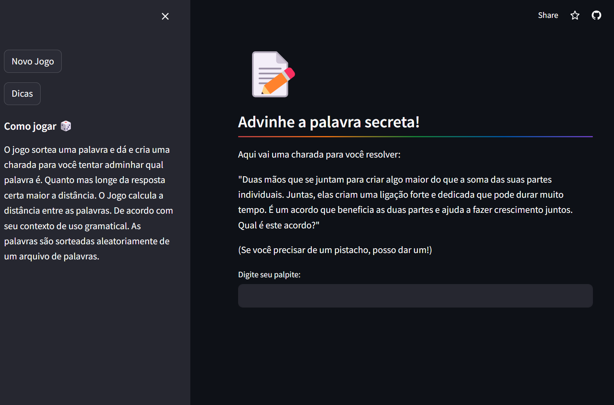
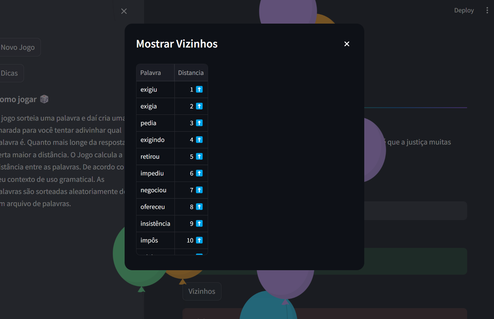
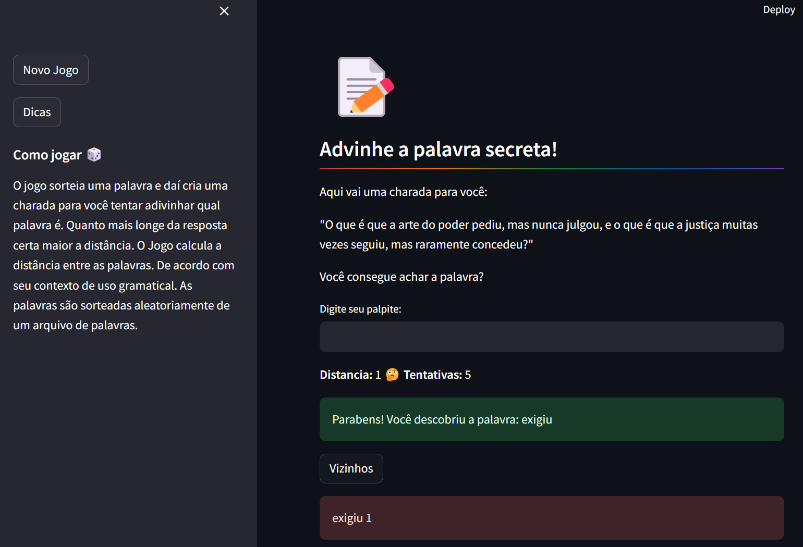

# Jogo de Palavrinhas #


**Como Jogar**
O jogo sorteia uma palavra e daí e cria uma charada para você tentar adivinhar qual palavra é. Quanto mais longe da resposta certa maior a distância. O Jogo calcula a distância entre as palavras. De acordo com seu contexto de uso gramatical. As palavras são sorteadas aleatoriamente de um arquivo de palavras.

**Tecnicamente**:
Primeiro o jogo sorteia a palavra, para não vir palavras muito difíceis foi usado a biblioteca
`mac_morpho` (que possui uma série de textos em português) do `NLTK`, e calculado frequência das palavras e obtido as mais usadas.
O Jogo usa embeddings de palavras, pré treinados pelo centro de linguística da **USP**.
Utiliza usa a similaridade L2 para calcular os K vizinhos mais próximos.
Para saber mais da biblioteca de embeddings [nilc.icmc.usp.br](http://www.nilc.icmc.usp.br/embeddings/)

## Tecnologias Utilizadas

- [**Streamlit**](https://streamlit.io/): Framework front-end para construir aplicações web interativas com Python.
- [**Pandas**](https://pandas.pydata.org/): Biblioteca para manipulação e análise de dados.
- [**FAISS**](https://github.com/facebookresearch/faiss): Biblioteca para busca de similaridade eficiente e clustering de vetores densos.
- [**NLTK**](https://www.nltk.org/): Toolkit de Processamento de Linguagem Natural para tarefas de processamento de linguagem.
- [**Groq**](https://groq.com/): Plataforma de cloud que fornece API para uso de modelos de LLM fundacionais.

## Funcionalidades do Jogo ##
 
1. **Palavra Secreta Aleatória**: Uma palavra secreta é selecionada aleatoriamente de uma lista predefinida de palavras.
2. **Geração de Pistas**: Cada palavra secreta vem com uma pista semelhante a uma charada para ajudar na adivinhação.
3. **Cálculo de Distância**: Utiliza embeddings de palavras e a métrica de distância L2 para determinar quão próxima a palavra adivinhada está da palavra secreta.
4. **Sistema de Dicas**: Fornece dicas mostrando palavras vizinhas com base na similaridade com a palavra secreta.
5. **Estado Persistente**: Mantém o controle das tentativas do usuário e permite reiniciar o jogo com uma nova palavra secreta.

## Como rodar ##

Para criação dos índices de palavras foi usado o FAISS, foi usado um embedding pré-treinado pelo [NILC](# http://www.nilc.icmc.usp.br/embeddings) da [USP](https://www5.usp.br/), foi usado a versão GloVe de 50 dimensões, e importado diretamente para o FAISS, para manter a relação entre palavras e embedding foi criado um arquivo pickle.

- data.py: Script para gerar o arquivo de index.faiss e o arquivo pickel
- backend.py: contém as funções para rodar a aplicação
- app.py: Front End que usa o StreamLit

1. Faça o clone do repositório

```
git clone <repository_url>
cd <repository_name>
```

2. Instale as dependências

```
pip install -r requirements.txt
```

3. Baixe o arquivo de embeddings na página do [NILC](http://www.nilc.icmc.usp.br/embeddings
4. Rode o script backend.py para gerar os dados para aplicação.
5. Crie um chave de api no Groq Cloud, e salve em um arquivo .env, com o nome `GROQ_API_KEY`
6. Rode o Aplicativo com o streamlit

```
streamlit run app.py
```

4. Acesso o jogo pela url `http://localhost:8501`.

## Screenshots







## License

This project is licensed under the MIT License - see the `LICENSE` file for details.

## Referencias


- https://www.linguateca.pt/ACDC/
- http://www.nilc.icmc.usp.br/nilc/tools/nilctaggers.html
- https://medium.com/turing-talks/pos-tagging-da-teoria-%C3%A0-implementa%C3%A7%C3%A3o-eafa59c9d115
- https://medium.com/@evelyn.roque04/estudo-sobre-processamento-de-linguagem-natural-com-nltk-29cfe41923c3
